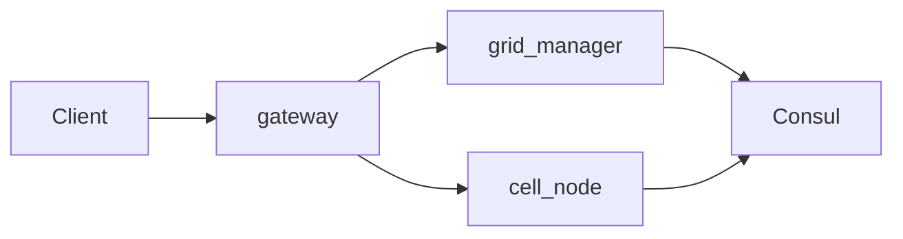

Отлично! Сделаю подробный **чеклист** по этапам разработки и деплоя MMO с рекурсивным масштабированием. Каждый пункт — это конкретное действие с критерием готовности.

---

# MMO Backend Development & Deployment Checklist

---

## Снимок состояния (март 2026)

Этот раздел отражает **фактическое состояние репозитория MMO**, а не весь aspirational-чеклист ниже.

- **Стек:** Go, protobuf в `proto/`, ECS в `internal/ecs`, репликация в `internal/replic`, обнаружение сот в `internal/discovery` (Consul HTTP API, `hashicorp/consul/api`).
- **Деплой staging:** `scripts/deploy-staging.sh` (тесты → образ → Harbor → OpenTofu), манифесты в `deploy/terraform/staging/`; смоук `scripts/staging-verify.sh` (registry, cell ping, gateway `/healthz`, ws-smoke).
- **Kubernetes:** рабочий кластер (в т.ч. Talos); приложение в namespace **`mmo`** — это не то же самое, что примеры `mmo-backend` / `monitoring` / `state` в пункте 0.1 ниже (см. `deploy/terraform/staging/main.tf`).
- **Поток трафика:** клиент → `cmd/gateway/main.go` (JWT `/v1/session`, WebSocket `/v1/ws`) → `ResolvePosition` у `cmd/grid-manager` (каталог из Consul) → gRPC `cmd/cell-node` (`Ping`, `Join`, `Leave`, `ApplyInput`, `SubscribeDeltas`) → симуляция `internal/cellsim` + ECS; метрики: `GET /metrics` на gateway, на соте флаг `-metrics-listen` (в staging через `cell_metrics_port` в Terraform).
- **Consul:** регистрация с `bounds`, `level`, логический id в meta (`mmo_cell_id`), уникальный id инстанса на pod (`HOSTNAME`); при shutdown — `ServiceDeregister` по тому же составному id. **Без отдельного health-check:** в каталоге сервис без checks считается passing (обход проблем `UpdateTTL` на агенте в этом окружении).

**Следующий шаг (приоритет):**

1. gRPC `Update` / команды, сплит соты; персист снепшота при shutdown.
2. ServiceMonitor / scrape Prometheus в кластере, дашборды Grafana.
3. Клиент Unity или расширенный отладочный клиент (интерполяция, UI).

---

## Phase 0: Фундамент (2-3 месяца)

### 0.1 Инфраструктура и оркестрация

#### ☐ Настройка Kubernetes кластера
- [ ] Установлен minikube/k3s для разработки
- [x] Настроен production-кластер (или облачный managed k8s) — staging (в т.ч. Talos)
- [x] kubectl работает с правильным контекстом
- [ ] Установлен Helm 3.x
- [ ] Настроены namespace: `mmo-backend`, `monitoring`, `state` *(в репозитории используется **`mmo`** для приложения — см. Terraform staging)*

#### ☐ Custom Controller для управления сотами
- [ ] Создан CRD `Cell` (apiVersion: `mmo.io/v1`)
- [ ] Реализован контроллер на Kubebuilder/controller-runtime
- [ ] Контроллер умеет создавать Pod при создании CRD
- [ ] Контроллер умеет удалять Pod при удалении CRD
- [ ] Контроллер регистрирует события в NATS
- [ ] **Критерий:** `kubectl apply -f cell.yaml` создает Pod

#### ☐ Service Discovery
- [x] Установлен Consul (или etcd) в кластер
- [x] Настроен DNS-записи для Consul (внутрикластерный DNS, например `mmo-consul-server.consul.svc`)
- [x] Клиентская библиотека для Go (consul/api)
- [x] Соты регистрируются при старте с метаданными (bounds, level)
- [x] Соты deregister при graceful shutdown
- [x] **Критерий:** `consul catalog services` показывает активные соты (проверяется через `staging-verify` / health API `mmo-cell`)

#### ☐ Message Bus
- [ ] Установлен NATS JetStream через Helm (из вашего инфра-стека)
- [x] Созданы топики: `cell.events`, `cell.migration`, `grid.commands` *(как константы субъектов в `internal/bus/nats/subjects.go`; не обязательно заведены на брокере)*
- [x] Реализован publisher в Go *(утилита `mmoctl nats`, клиент core в `internal/bus/nats`)*
- [ ] Реализован subscriber с reconnect logic *(полноценная подписка в сервисах — позже)*
- [ ] **Критерий:** Два сервиса обмениваются сообщениями через NATS *(частично: dev/smoke через `mmoctl`; JetStream и кластерные сценарии — нет)*

#### ☐ Базы данных
- [ ] PostgreSQL установлен (из вашего инфра-стека)
- [ ] ScyllaDB установлен (если используется)
- [ ] Redis Cluster установлен (из вашего инфра-стека)
- [ ] Созданы миграции для PostgreSQL (таблицы players, inventory)
- [ ] Настроены keyspaces/tables в ScyllaDB
- [ ] **Критерий:** `psql` подключается, `redis-cli ping` работает

---

### 0.2 Ядро симуляции

#### ☐ ECS Framework
- [x] Реализованы базовые интерфейсы: `Entity`, `Component`, `System`
- [x] Создан `World` как контейнер для сущностей
- [x] Реализован `Query` для фильтрации компонентов
- [x] Написаны тесты для ECS операций (создание, удаление, поиск)
- [x] **Критерий:** Тесты проходят, нет утечек памяти

#### ☐ Тик-цикл
- [x] Реализован `GameLoop` с фиксированным шагом (20-30 TPS) — сота: 25 TPS в `internal/cellsim`
- [x] Добавлен `deltaTime` для систем (`FixedDT` / аргумент `dt` в `System.Update`)
- [ ] Реализована пауза/возобновление
- [x] Метрики: время тика, количество обработанных сущностей (`internal/ecs/loop.go` — `LoopStats`)
- [ ] **Критерий:** 60 секунд работы без накопления задержки *(не оформлено отдельным бенчмарком)*

#### ☐ Компоненты и системы (базовые)
- [x] Компонент `Position` (x, y, z)
- [x] Компонент `Velocity` (vx, vy, vz)
- [x] Система `MovementSystem` (обновляет позицию по скорости)
- [x] Компонент `Health` (hp, max_hp)
- [x] Система `HealthRegenSystem` (восстановление HP)
- [x] **Критерий:** много NPC с движением — через `cell-node --demo-npcs N` (`internal/cellsim`); без флага — минимум один мир/демо

#### ☐ Пространственное индексирование (AOI)
- [x] Реализована сетка (grid) с ячейками 50x50 (`internal/ecs/aoi`, размер ячейки настраивается, по умолчанию 50)
- [x] Функция получения соседних ячеек для радиуса видимости (`QueryRadius`, `NeighborCellKeys`)
- [ ] Компонент `SpatialHash` обновляется при движении *(есть `SpatialGrid` вне ECS-мира; интеграция с `MovementSystem`/`World` — позже)*
- [ ] **Критерий:** Запрос AOI для игрока в прод-пути репликации *(юнит-тесты сетки есть; не подключено к стримингу)*

#### ☐ Базовая физика
- [ ] Проверка коллизий AABB (Axis-Aligned Bounding Box)
- [ ] Разрешение коллизий (простое отталкивание)
- [ ] Триггеры (зоны)
- [ ] **Критерий:** Два NPC не проходят друг сквозь друга

---

### 0.3 Сетевой слой

#### ☐ Протокол и сериализация
- [x] Определены Protobuf сообщения: `ClientInput`, `Snapshot`, `Delta`
- [x] Сгенерированы Go код из `.proto` *(C# в этом репозитории не ведётся)*
- [ ] Сгенерированы C# код из `.proto`
- [x] Реализована бинарная сериализация (protobuf)
- [ ] **Критерий:** Размер пакета < 1400 байт *(не проверялся как SLO)*

#### ☐ Gateway сервис
- [x] Реализован HTTP endpoint для аутентификации (JWT)
- [x] WebSocket/UDP листенер для клиентов *(WebSocket; UDP — нет)*
- [x] Прокси-роутинг: клиент → правильная сота *(resolve + gRPC к cell после upgrade)*
- [x] Проброс бинарного `ClientInput` по WebSocket → gRPC `ApplyInput` на соту; при закрытии сокета — `Leave`
- [x] Rate limiting (100 req/sec на клиента)
- [x] **Критерий:** Клиент подключается, получает токен, получает бинарный стрим с соты *(см. `ws-smoke`; отдельное «чисто сотовое» UDP-соединение — нет)*

#### ☐ Репликация
- [ ] Система `NetworkReplicationSystem` как отдельная ECS-система
- [x] Сбор изменений за тик (`TakeDirtyEntities`) и формирование дельт (только изменённые сущности) — `internal/replic`, `internal/grpc/cellsvc`
- [ ] Приоритизация: игроки > NPC > предметы *(частично: флаг игрока в `EntityState.flags`)*
- [ ] Адаптивная частота (близкие объекты чаще)
- [x] **Критерий:** Клиент получает дельты и корректно отображает *( smoke: снапшот + дельты по WS)*

#### ☐ Клиент-отладчик
- [ ] Unity проект с базовым рендерингом (кубы вместо моделей)
- [ ] Сетевая абстракция (INetworkManager)
- [ ] Интерполяция позиций
- [ ] Простой UI (FPS, координаты, health)
- [ ] **Критерий:** Игрок двигается, видит других игроков

---

### 0.4 Интеграция и первая сота

#### ☐ Первая сота (Cell Service)
- [x] Реализован gRPC сервер: `Ping`, `Join`, `SubscribeDeltas`, `ApplyInput`, `Leave`
- [ ] Реализованы gRPC: `Update`, `Split` *(нет в `proto/cell/v1/cell.proto`)*
- [x] Интегрированы ECS + сетевой стрим репликации *(AOI в игровом цикле cell-node не задействован)*
- [ ] Graceful shutdown: сохранение снепшота в Redis/Scylla
- [x] Регистрация в Consul при старте
- [x] **Критерий:** Один под запущен, игрок может подключиться *(staging + ws-smoke)*

#### ☐ Grid Manager (базовый)
- [ ] Мониторинг метрик через Prometheus (players, entities, cpu)
- [ ] Анализ порогов (hardcoded для начала)
- [ ] gRPC клиент для коммуникации с сотами *(сервис — сервер Registry; вызовы в сторону cell — через gateway/клиентов)*
- [ ] Логирование всех операций
- [x] **Критерий:** Grid Manager видит одну соту в Consul (`ListCells` / `ResolvePosition` над каталогом)

#### ☐ Мониторинг и observability
- [ ] Prometheus метрики для всех Go сервисов *(частично: `GET /metrics` на **gateway** и опционально **cell-node** `-metrics-listen`, см. Terraform `cell_metrics_port`)*
- [ ] Grafana дашборды: количество игроков, активных сот, latency
- [ ] Loki для логов (structured logging в JSON)
- [ ] Tempo для трассировки (опционально)
- [ ] **Критерий:** На дашборде видна активность

#### Следующий шаг (кратко)

RPC `Update` / игровой командный слой, сплит сот, персист снепшотов; дашборды Grafana и scrape Prometheus в кластере; клиент Unity или расширенный `ws-smoke`.

---

## Phase 1: Базовая MMO (3-4 месяца)

### 1.1 Игровая логика

#### ☐ Combat System
- [ ] Компонент `Combat` (damage, range, cooldown)
- [ ] Система `CombatSystem` (проверка дистанции, нанесение урона)
- [ ] Событие `DamageEvent` в NATS
- [ ] Анимация получения урона на клиенте
- [ ] **Критерий:** Два игрока могут драться, HP уменьшается

#### ☐ Инвентарь и предметы
- [ ] Компонент `Inventory` (список предметов)
- [ ] Система `PickupSystem` (подбор с земли)
- [ ] Система `UseItemSystem` (использование зелий и т.д.)
- [ ] PostgreSQL для персистентного инвентаря
- [ ] **Критерий:** Игрок поднимает предмет, он появляется в инвентаре

#### ☐ NPC и AI
- [ ] Компонент `AI` (state: idle, patrol, combat)
- [ ] Система `AISystem` (FSM)
- [ ] Патрулирование по waypoints
- [ ] Агро на игроков в радиусе
- [ ] **Критерий:** NPC преследует игрока в радиусе 10 метров

#### ☐ Прогрессия
- [ ] Компонент `Experience` (xp, level)
- [ ] Система `LevelUpSystem` (повышение статов)
- [ ] Таблицы в PostgreSQL для уровней
- [ ] **Критерий:** Убийство NPC дает XP, при достижении порога уровень растет

#### ☐ Чат
- [ ] Глобальный чат (NATS)
- [ ] Локальный чат (в пределах соты)
- [ ] Команды: `/help`, `/who`
- [ ] Фильтрация мата (базовая)
- [ ] **Критерий:** Сообщения доставляются всем в соте

---

### 1.2 Оптимизация сетевого слоя

#### ☐ Interest Management (улучшенный)
- [ ] AOI на основе сетки с подпиской на ячейки
- [ ] Динамическое обновление подписок при движении
- [ ] Приоритизация сущностей по расстоянию
- [ ] **Критерий:** Клиент получает только объекты в радиусе 50 метров

#### ☐ Сжатие и оптимизация
- [ ] Сжатие Snappy/Zstd для больших пакетов
- [ ] Дельта-кодирование позиций (только изменение)
- [ ] Бачинг сообщений (несколько дельт в одном пакете)
- [ ] **Критерий:** Трафик снижен на 40-60%

#### ☐ Client-side prediction
- [ ] Клиент сохраняет последние инпуты
- [ ] Локальная симуляция движения
- [ ] Reconciliation с сервером (reconciliation)
- [ ] Сглаживание (lerp) при рассинхроне
- [ ] **Критерий:** При задержке 100ms движение остается плавным

---

### 1.3 Нагрузочное тестирование

#### ☐ Боты-симуляторы
- [ ] Скрипт на Go для запуска N ботов
- [ ] Боты проходят простые сценарии: спавн, движение, чат
- [ ] Метрики: активные соединения, CPU, память
- [ ] **Критерий:** 200 ботов работают стабильно 1 час

#### ☐ Профилирование и оптимизация
- [ ] pprof профилирование CPU и памяти
- [ ] Оптимизация hot path (меньше аллокаций)
- [ ] Object pooling для часто создаваемых объектов
- [ ] **Критерий:** 90-й перцентиль времени тика < 16ms

---

### 1.4 Клиентский скелет

#### ☐ Рендеринг
- [ ] Загрузка 3D моделей (placeholder)
- [ ] Анимации (idle, run, attack)
- [ ] Камера от третьего лица
- [ ] **Критерий:** Игрок видит своего персонажа и NPC

#### ☐ UI
- [ ] Панель здоровья
- [ ] Окно инвентаря
- [ ] Окно чата
- [ ] Мини-карта (показ ближайших NPC)
- [ ] **Критерий:** Все UI элементы интерактивны

#### ☐ Сетевая абстракция
- [ ] Клиент не знает о существовании сот
- [ ] Единый `GameServer` интерфейс
- [ ] Автоматическое переподключение при ошибках
- [ ] **Критерий:** При смене соты клиент не падает

---

## Phase 2: Горизонтальное масштабирование (4-5 месяцев)

### 2.1 Grid Manager (полная реализация)

#### ☐ Управление топологией
- [ ] Дерево сот (parent-child relationships)
- [ ] Функция `FindCellByPosition(x, z)` с учетом уровня
- [ ] Хранение топологии в Redis
- [ ] **Критерий:** Запрос позиции возвращает правильную соту

#### ☐ Автоматические решения split/merge
- [ ] Анализ метрик каждые 30 секунд
- [ ] Алгоритм принятия решений (пороги, кулдауны)
- [ ] Планирование split/merge в очереди
- [ ] **Критерий:** При превышении порога Grid Manager инициирует split

#### ☐ API управления
- [ ] gRPC методы: `InitSplit`, `InitMerge`, `GetTopology`
- [ ] REST API для администрирования (опционально)
- [ ] Web UI для просмотра топологии (simple React)
- [ ] **Критерий:** Админ видит карту сот в реальном времени

---

### 2.2 Механизм деления (Split)

#### ☐ Подготовка родительской соты
- [ ] Команда `Split` через gRPC
- [ ] Переход в состояние `FROZEN` (остановка новых соединений)
- [ ] Уведомление клиентов о заморозке
- [ ] Сохранение полного снепшота в Redis/Scylla
- [ ] **Критерий:** Все клиенты получили `WORLD_FREEZE` сообщение

#### ☐ Партиционирование
- [ ] Функция вычисления дочерних границ (4 квадранта)
- [ ] Распределение сущностей по координатам
- [ ] Детерминированные правила для граничных объектов
- [ ] **Критерий:** Каждая сущность попадает ровно в одну дочернюю соту

#### ☐ Миграция данных
- [ ] Публикация сущностей в NATS по топикам `cell.migration.{child_id}`
- [ ] Дочерние соты подписываются и загружают данные
- [ ] Подтверждение готовности через gRPC
- [ ] **Критерий:** Все 4 дочерние соты сообщили `Ready`

#### ☐ Атомарное переключение
- [ ] Двухфазный коммит через Grid Manager
- [ ] Обновление Consul (родитель → `SPLIT`, дети → `ACTIVE`)
- [ ] Отправка клиентам `REDIRECT` с новыми эндпоинтами
- [ ] Graceful shutdown родительской соты
- [ ] **Критерий:** Игроки переподключились к новым сотам за < 1 сек

---

### 2.3 Механизм слияния (Merge)

#### ☐ Обнаружение кандидатов на merge
- [ ] Мониторинг соседних сот одного родителя
- [ ] Проверка, что все 4 соты имеют низкую нагрузку
- [ ] Кулдаун после последнего split
- [ ] **Критерий:** Grid Manager предлагает merge при нагрузке < 10%

#### ☐ Подготовка к merge
- [ ] Команда `PrepareMerge` всем 4 сотам
- [ ] Заморозка всех 4 сот
- [ ] Сбор снепшотов от каждой соты
- [ ] **Критерий:** Все 4 соты перешли в `FROZEN`

#### ☐ Объединение состояния
- [ ] Создание новой родительской соты (или разморозка старой)
- [ ] Объединение сущностей из 4 снепшотов
- [ ] Разрешение конфликтов (если сущность на границе дублировалась)
- [ ] **Критерий:** В новой соте все сущности на месте

#### ☐ Активация
- [ ] Запуск новой родительской соты (или разморозка)
- [ ] Обновление Consul
- [ ] Перенаправление клиентов
- [ ] Удаление дочерних подов
- [ ] **Критерий:** Игроки перешли в объединенную соту незаметно

---

### 2.4 Границы и фантомы

#### ☐ Обнаружение соседей
- [ ] Функция `GetNeighbors(bounds)` для нахождения смежных сот
- [ ] Подписка на изменения соседей через Consul watch
- [ ] **Критерий:** Сота знает о существовании всех соседей

#### ☐ Phantom Entities
- [ ] gRPC стриминг для передачи объектов на границе
- [ ] Локальное кэширование фантомов
- [ ] Синхронизация позиций фантомов каждые 200ms
- [ ] **Критерий:** Игрок видит NPC из соседней соты

#### ☐ Взаимодействие через границу
- [ ] Проверка: игрок в соте A атакует NPC в соте B
- [ ] Передача `DamageEvent` через NATS
- [ ] Применение урона в целевой соте
- [ ] Репликация результата обратно
- [ ] **Критерий:** Урон проходит через границу корректно

#### ☐ Бесшовный переход между сотами
- [ ] Клиент предзагружает соединение с соседней сотой
- [ ] Переключение при пересечении границы (не более 50ms)
- [ ] Сохранение состояния (не потеря инпутов)
- [ ] **Критерий:** Переход незаметен для игрока

---

## Phase 3: Оптимизация и полировка (3-4 месяца)

### 3.1 Производительность

#### ☐ Профилирование под нагрузкой
- [ ] 1000 ботов на staging
- [ ] pprof анализ CPU/памяти для каждого сервиса
- [ ] Выявление узких мест (сетка, сериализация, БД)
- [ ] **Критерий:** Создан отчет с рекомендациями

#### ☐ Оптимизация ECS
- [ ] Использование массивов структур (SoA) для горячих компонентов
- [ ] Уменьшение количества аллокаций в тике
- [ ] Векторизация (SIMD) для массовых операций (опционально)
- [ ] **Критерий:** Тик < 10ms для 5000 сущностей

#### ☐ Оптимизация NATS
- [ ] Настройка кластера NATS (3+ ноды)
- [ ] JetStream для durable subscriptions
- [ ] Мониторинг задержек доставки
- [ ] **Критерий:** 99-й перцентиль задержки < 10ms

#### ☐ Балансировка сот
- [ ] Anti-affinity правила: соседние соты на разных нодах
- [ ] Автоматическое перемещение сот при перегрузке ноды
- [ ] **Критерий:** При падении ноды соты пересоздаются на других

---

### 3.2 Надежность

#### ☐ Chaos Engineering
- [ ] Тесты: убийство случайного пода
- [ ] Тесты: сетевые разделения (network partition)
- [ ] Тесты: отказ NATS кластера
- [ ] Тесты: отказ PostgreSQL master
- [ ] **Критерий:** Система восстанавливается автоматически

#### ☐ Автоматическое восстановление
- [ ] Grid Manager пересоздает упавшие соты
- [ ] Восстановление состояния из последнего снепшота
- [ ] Replay событий из NATS после восстановления
- [ ] **Критерий:** После kill -9 пода сота перезапускается < 30 сек

#### ☐ Резервное копирование
- [ ] Регулярные бэкапы PostgreSQL (pg_dump)
- [ ] Снепшоты ScyllaDB
- [ ] Резервное копирование Redis (RDB/AOF)
- [ ] **Критерий:** Восстановление из бэкапа протестировано

#### ☐ Disaster Recovery
- [ ] Документация по восстановлению всего кластера
- [ ] Регулярные учения (fire drills)
- [ ] **Критерий:** Восстановление с нуля < 1 часа

---

### 3.3 Безопасность

#### ☐ Античит
- [ ] Серверная валидация: проверка скорости (anti-speedhack)
- [ ] Проверка коллизий (anti-wallhack)
- [ ] Rate limiting для действий (атака, использование предметов)
- [ ] **Критерий:** Невозможно двигаться быстрее лимита

#### ☐ Шифрование
- [ ] TLS для gRPC (сертификаты)
- [ ] DTLS для WebRTC
- [ ] Шифрование секретов в Vault (не в plain text)
- [ ] **Критерий:** В wireshark трафик не читается

#### ☐ Аутентификация и авторизация
- [ ] JWT с коротким временем жизни (15 мин)
- [ ] Refresh token механизм
- [ ] Роли: player, moderator, admin
- [ ] **Критерий:** Админ имеет доступ к командам, игрок — нет

#### ☐ Аудит
- [ ] Логирование всех действий модераторов
- [ ] Логирование подозрительных действий (читы, спам)
- [ ] Централизованное хранение аудит-логов
- [ ] **Критерий:** По запросу можно восстановить действия игрока

---

### 3.4 DevOps и CI/CD

#### ☐ CI/CD пайплайн
- [ ] GitHub Actions/GitLab CI для автоматической сборки
- [ ] Автоматические тесты (unit, integration) при PR
- [ ] Сборка Docker образа с тегом git commit hash
- [ ] Автоматический деплой в staging при push в main
- [ ] **Критерий:** После merge код появляется на staging < 10 мин

#### ☐ Staging окружение
- [ ] Полная копия production (но с меньшими ресурсами)
- [ ] Изолированные данные (отдельная БД)
- [ ] Автоматическое заполнение тестовыми данными
- [ ] **Критерий:** Разработчики тестируют новые фичи на staging

#### ☐ Мониторинг и алерты
- [ ] Настроены алерты в Prometheus (CPU > 80%, players резко упали)
- [ ] PagerDuty интеграция для критических алертов
- [ ] SLI/SLO определены (доступность 99.9%, latency p99 < 100ms)
- [ ] **Критерий:** Алерты приходят при проблемах

#### ☐ Документация
- [ ] Архитектурная документация (diagrams + text)
- [ ] API документация (protobuf + комментарии)
- [ ] Runbook для SRE (как деплоить, как откатить)
- [ ] **Критерий:** Новый разработчик может запустить локально за 1 день

---

## Phase 4: Запуск и пост-релиз (2-3 месяца)

### 4.1 Предрелизная подготовка

#### ☐ Финальное нагрузочное тестирование
- [ ] 5000 ботов на staging
- [ ] 48 часов стабильной работы
- [ ] Мониторинг всех метрик
- [ ] **Критерий:** 0 критических ошибок за 48 часов

#### ☐ Security audit
- [ ] Внешний пентест (можно автоматизированный)
- [ ] Проверка OWASP Top 10
- [ ] Анализ зависимостей на уязвимости (Snyk)
- [ ] **Критерий:** Все критические уязвимости исправлены

#### ☐ Юридические аспекты
- [ ] Пользовательское соглашение (Terms of Service)
- [ ] Политика конфиденциальности (Privacy Policy)
- [ ] Согласие на обработку данных (GDPR)
- [ ] **Критерий:** Юристы одобрили

#### ☐ Окончательная настройка мониторинга
- [ ] Дашборды для бизнеса (DAU, retention, revenue)
- [ ] Алерты для всех критических метрик
- [ ] Playbook для каждого алерта (что делать)
- [ ] **Критерий:** SRE знает, что делать при каждом алерте

---

### 4.2 Soft Launch

#### ☐ Ограниченный доступ
- [ ] Пригласительная система (500 слотов)
- [ ] Форма для фидбека
- [ ] Баг-трекер (Jira/Linear) готов
- [ ] **Критерий:** 500 активных игроков в течение недели

#### ☐ Сбор метрик
- [ ] Анализ поведения игроков (где застревают, где донатят)
- [ ] Сбор реальных данных о split/merge
- [ ] Анализ производительности под реальной нагрузкой
- [ ] **Критерий:** Отчет с метриками за первую неделю

#### ☐ Быстрые фиксы
- [ ] Процесс hotfix (без даунтайма)
- [ ] Приоритизация багов от игроков
- [ ] **Критерий:** Критические баги фиксятся за < 4 часов

#### ☐ Масштабирование под нагрузку
- [ ] Автомасштабирование Gateway (HPA)
- [ ] Увеличение ресурсов для сот при необходимости
- [ ] **Критерий:** Система выдерживает пиковые нагрузки

---

### 4.3 Full Launch

#### ☐ Открытый доступ
- [ ] Снятие ограничений на регистрацию
- [ ] Маркетинговые кампании
- [ ] **Критерий:** 10000+ регистраций в первый день

#### ☐ 24/7 поддержка
- [ ] SRE on-call ротация
- [ ] Система тикетов для игроков
- [ ] **Критерий:** Время реакции на инцидент < 15 мин

#### ☐ Итеративное улучшение
- [ ] Спринты по 2 недели
- [ ] Сбор фидбека от игроков
- [ ] Приоритизация фич по данным
- [ ] **Критерий:** Релиз каждые 2 недели

#### ☐ Оптимизация затрат
- [ ] Анализ использования ресурсов
- [ ] Reserved instances для стабильных нагрузок
- [ ] Spot instances для некритичных воркеров
- [ ] **Критерий:** Снижение затрат на 30% без потери производительности

---

## Итоговая таблица прогресса

| Phase | Всего задач | Статус | Комментарий |
|-------|-------------|--------|-------------|
| Phase 0 | 52 | ☐ | |
| Phase 1 | 48 | ☐ | |
| Phase 2 | 56 | ☐ | |
| Phase 3 | 52 | ☐ | |
| Phase 4 | 32 | ☐ | |
| **Total** | **240** | **0%** | |

---

Этот чеклист можно использовать:
1. **Для планирования спринтов** — разбивайте задачи по спринтам (2 недели)
2. **Для отслеживания прогресса** — отмечайте выполненные пункты
3. **Для код-ревью** — проверяйте, что задача выполнена полностью
4. **Для онбординга** — новый разработчик видит полную картину

Если нужны детали по любой задаче (например, "как реализовать двухфазный коммит для split" или "как настроить HPA для Gateway"), дай знать — раскрою конкретный пункт.